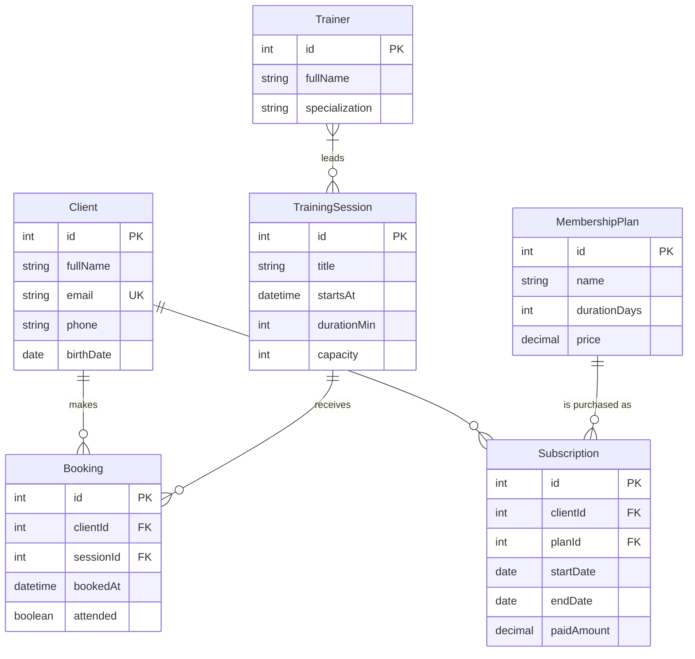

```mermaid
erDiagram
    %% AC-9: пара (clientId, sessionId) у Booking унікальна
    %% AC-9: кількість записів Booking на заняття не перевищує TrainingSession.capacity
    %% AC-9: Subscription.endDate не раніше Subscription.startDate

    Client ||--o{ Booking : makes
    TrainingSession ||--o{ Booking : receives
    Client ||--o{ Subscription : buys
    MembershipPlan ||--o{ Subscription : "is purchased as"
    Trainer }|--o{ TrainingSession : leads

    Client {
        int id PK
        string fullName
        string email UK
        string phone
        date birthDate
    }

    Trainer {
        int id PK
        string fullName
        string specialization
    }

    TrainingSession {
        int id PK
        string title
        datetime startsAt
        int durationMin
        int capacity
    }

    MembershipPlan {
        int id PK
        string name
        int durationDays
        decimal price
    }

    Booking {
        int id PK
        int clientId FK
        int sessionId FK
        datetime bookedAt
        boolean attended
    }

    Subscription {
        int id PK
        int clientId FK
        int planId FK
        date startDate
        date endDate
        decimal paidAmount
    }
```
