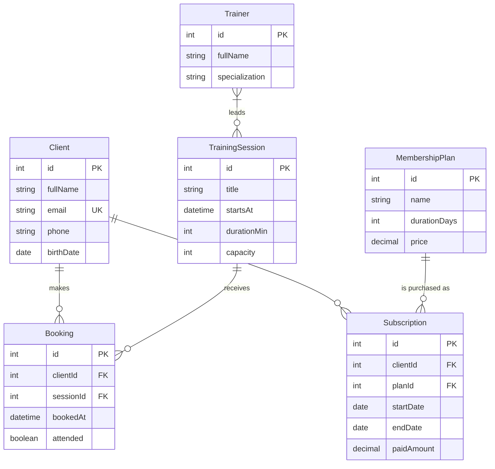

```mermaid
erDiagram
    %% Rule 1: pair (clientId, sessionId) in Booking is unique
    %% Rule 2: number of Booking per TrainingSession does not exceed capacity
    %% Rule 3: endDate is not earlier than startDate
    %% Rule 4: Subscription periods (startDate-endDate) of one Client do not overlap: at most one active Subscription at a time

    Client ||--o{ Booking : makes
    TrainingSession ||--o{ Booking : receives
    Client ||--o{ Subscription : buys
    MembershipPlan ||--o{ Subscription : "is purchased as"
    Trainer }|--o{ TrainingSession : leads

    Client {
        int id PK
        string fullName
        string email UK
        string phone
        date birthDate
    }

    Trainer {
        int id PK
        string fullName
        string specialization
    }

    TrainingSession {
        int id PK
        string title
        datetime startsAt
        int durationMin
        int capacity
    }

    MembershipPlan {
        int id PK
        string name
        int durationDays
        decimal price
    }

    Booking {
        int id PK
        int clientId FK
        int sessionId FK
        datetime bookedAt
        boolean attended
    }

    Subscription {
        int id PK
        int clientId FK
        int planId FK
        date startDate
        date endDate
        decimal paidAmount
    }
```
