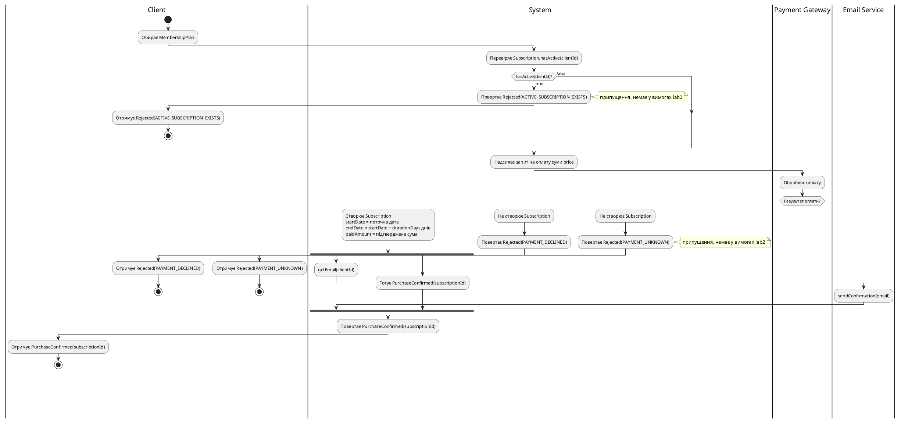

```plantuml
@startuml
|Client|
start
:Обирає MembershipPlan;

|System|
:Перевіряє Subscription.hasActive(clientId);
if (hasActive(clientId)?) then (true)
  :Повертає Rejected(ACTIVE_SUBSCRIPTION_EXISTS);
  note right: припущення, немає у вимогах lab2
  |Client|
  :Отримує Rejected(ACTIVE_SUBSCRIPTION_EXISTS);
  stop
else (false)
endif

|System|
:Надсилає запит на оплату суми price;

|Payment Gateway|
:Обробляє оплату;

switch (Результат оплати?)
case (підтверджено)
  |System|
  :Створює Subscription\nstartDate = поточна дата\nendDate = startDate + durationDays днів\npaidAmount = підтверджена сума;
  fork
    |System|
    :getEmail(clientId);
    |Email Service|
    :sendConfirmation(email);
  fork again
    |System|
    :Готує PurchaseConfirmed(subscriptionId);
  end fork
  |System|
  :Повертає PurchaseConfirmed(subscriptionId);
  |Client|
  :Отримує PurchaseConfirmed(subscriptionId);
  stop
case (відхилено)
  |System|
  :Не створює Subscription;
  :Повертає Rejected(PAYMENT_DECLINED);
  |Client|
  :Отримує Rejected(PAYMENT_DECLINED);
  stop
case (немає відповіді)
  |System|
  :Не створює Subscription;
  :Повертає Rejected(PAYMENT_UNKNOWN);
  note right: припущення, немає у вимогах lab2
  |Client|
  :Отримує Rejected(PAYMENT_UNKNOWN);
  stop
endswitch
@enduml
```
